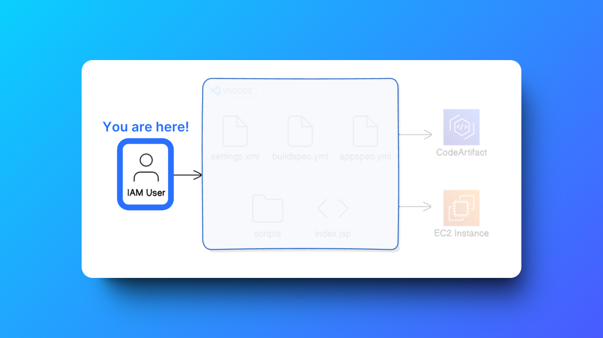
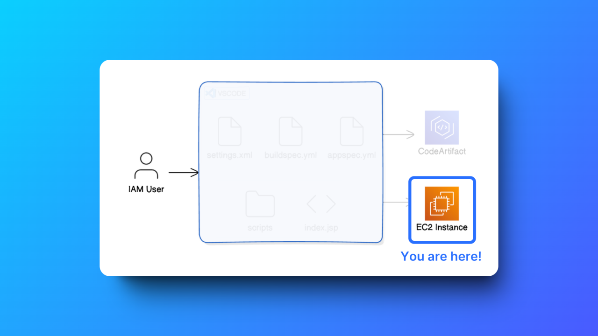
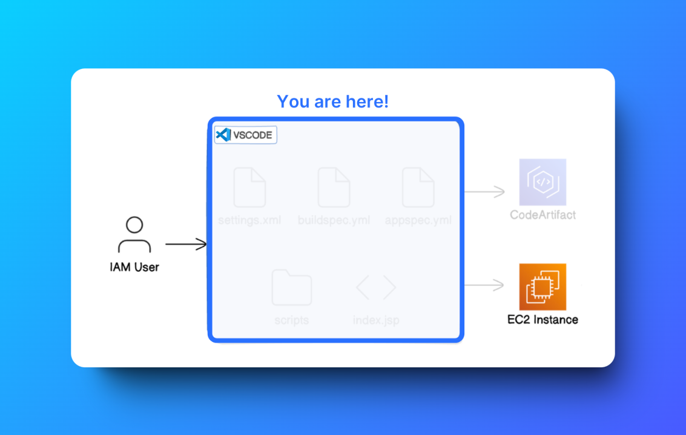
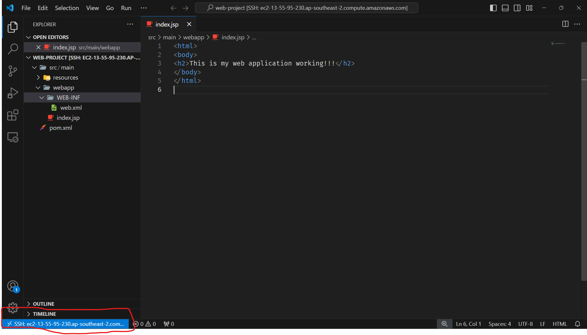
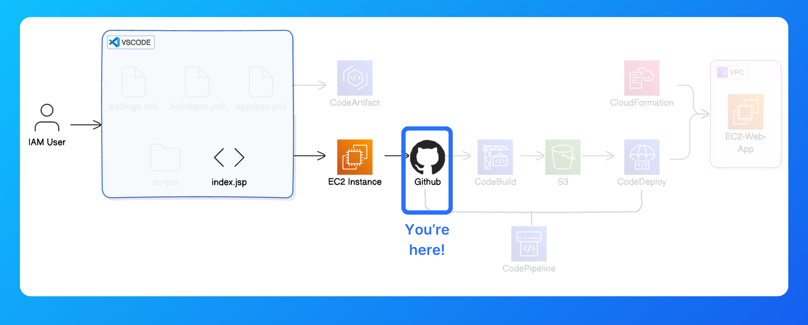
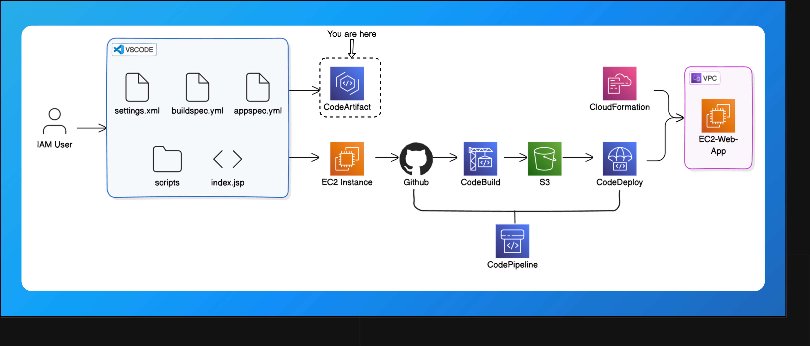

# End to End CI/CD Project with AWS

### **Complete Architecture**


---

## **1. Set Up a Web App in the Cloud**
### **Set up an IAM user:**
- It is a best practice to work with IAM user instead of working through Root user.
 
- Attach ***AdministratorAccess*** policy to the IAM user
- Now the work is only with IAM User, I am not going to work in Root user

### **Launch an EC2 Instance:**

- Give name to EC2 instance.
- Select AmazonAMI
- create-key pair
- save it in your PC
- Don't forget to change network access to MyIP in the Network settings.
- Click on create instance.

### **Connect to your EC2 Instance:**

- Using Public IPV4 DNS we can connect to EC2 instance using SSH
- Command connection
  -  ```
     ssh -i [XXXXXXX.pem] ec2-user@ec2-XX-XX-XX-XXX.ap-southeast-2.compute.amazonaws.com
     ```

 - Before the above make sure you have changes the permissions the .pem file
 ```
 icacls "nextwork-keypair.pem" /reset
 icacls "nextwork-keypair.pem" /grant:r "%USERNAME%:R"
 icacls "nextwork-keypair.pem" /inheritance:r
 ```
### **Install Apache Maven and Amazon Corretto 8:**
- Apache Maven Installation
 ```
  wget https://archive.apache.org/dist/maven/maven-3/3.5.2/binaries/apache-maven-3.5.2-bin.tar.gz

  sudo tar -xzf apache-maven-3.5.2-bin.tar.gz -C /opt

  echo "export PATH=/opt/apache-maven-3.5.2/bin:$PATH" >> ~/.bashrc

  source ~/.bashrc
 ```

- Java 8, or more specifically, Amazon Correto 8 Installation
```
 sudo dnf install -y java-1.8.0-amazon-corretto-devel

export JAVA_HOME=/usr/lib/jvm/java-1.8.0-amazon-corretto.x86_64

export PATH=/usr/lib/jvm/java-1.8.0-amazon-corretto.x86_64/jre/bin/:$PATH
```

### **Create the Application:**
- We've assembled both Maven and Java into our EC2 instance. Now let's cut straight to generating the web app!
- Use Maven to generate a java web app, to do this use the below commands
  - ```
     mvn archetype:generate \
      -DgroupId=com.webproject.app \
      -DartifactId=web-project \
      -DarchetypeArtifactId=maven-archetype-webapp \
      -DinteractiveMode=false
    ```
 - Watch out for a BUILD SUCCESS message in your terminal once your application is all set up.

### **Connect VSCode with your EC2 Instance:**
- Install an extension in VSCode.
- Use the extension to set up a connection between VSCode and your EC2 instance.
- Explore and edit your Java web app's files using VSCode.
- Succesfully connected and made changes to the code


---

## **2. Connect a GitHub Repo with AWS**


### **Install Git:**
- Commands to install git are given below
```
sudo dnf update -y
sudo dnf install git -y
```

- SignIn to GitHub account, if not there create account in GitHub.
- create a repository in GitHub


### **Commit and Push Your Changes to GithHub**
In this step, you're going to:
1. Set up a local git repo in your web app folder.
2. Connect your local repo with your GitHub repo.
3. Head back to your VSCode remote window. Make sure it's still SSH connected to your EC2 instance by checking the bottom left corner.
4. It is good practice to configure git before doing first commit
   
   ```
    git config --global user.name "Your Name"
    git config --global user.email you@nextwork.org
   ```

---

## **3. Dependencies and CodeArtifact**



### **💡What is AWS CodeArtifact?**
- Maven is going out to grab resources that live in the public internet to pull in your web app's packages - so imagine what might happen to your web app if these public resources suddenly become unavailable or    removed!In the real world, an outage of a dependency can completely break your CI/CD pipeline.
- Maven will fail to build your web app, so any testing and deploying of your latest updates are also forced to stop.This is where AWS CodeArtifact steps in.
- Think of AWS CodeArtifact as a private storage locker for you to keep a backup copy of all your web app's dependencies. Even if a dependency goes down in the public repository that it comes from, you can still   access your backup from CodeArtifact and continue building your app without any hiccups.
- You can imagine how CodeArtifact adds a layer of reliability and security, protecting your development process from external disruptions - super relevant to a DevOps role!

1. Choose Domains in the menu on the left, then Create domain.
2. Name your domain 'YOUR DOMAIN NAME'.
3. Choose Create domain.
4. Choose Create repository to create a repository for this new domain.
5. Name it.
6. For the description, let's add: Packages for the web app.
7. Select maven-central-store as the public upstream repository.

### **💡 What is the public upstream repository?**
- Your public upstream repository is not the same as the nextwork-packages repository that you're creating! First, take a look at the short description under "maven-central-store" - it provides artifacts from "Maven Central Repository". Let's break down how all these repositories are connected:
  1. Your local repository (i.e. your-packages)
  2. Public upstream repository (i.e. maven-central-store)
  3. Maven Central Repository
     
### **💡Why do we select maven-central-store?**
- We choose maven-central-store as our upstream repository because it’s connected to the biggest and most reliable library for Java packages (Maven Central Repository).
- We want to link it to our CodeArtifact to make sure CodeArtifact will make backups of the packages there

8. Click Next.
9. Click Create repository to finish the process.
10. On the next page, click View connection instructions. In the dialog, choose Mac & Linux for Operating system and mvn as package manager.
11. Copy the command in Step 3. This will look similar to the below:
    ```
     export CODEARTIFACT_AUTH_TOKEN=`aws codeartifact get-authorization-token --domain vishnu --domain-owner 339712919806 --region ap-southeast-2 --query authorizationToken --output text`
    ```
### **💡 What is this command for?** 
- "Export a CodeArtifact authorization token for authorization to your repository from your preferred shell."
- Sounds a little technical, but it's actually just like giving your VSCode IDE connected through remote-ssh a key to open your repositories in CodeArtifact.

12. Create settings.xml file in the web app.
13. Add the step 4,5,6 codes enclosed in ```<settings> * </settings>```, settings.xml file looks like as shown below.
```
<settings>
    <servers>
    <server>
        <id>vishnu-vishnu-packages</id>
        <username>aws</username>
        <password>${env.CODEARTIFACT_AUTH_TOKEN}</password>
    </server>
    </servers>

    <profiles>
    <profile>
        <id>vishnu-vishnu-packages</id>
        <activation>
        <activeByDefault>true</activeByDefault>
        </activation>
        <repositories>
        <repository>
            <id>vishnu-vishnu-packages</id>
            <url>https://vishnu-339712919806.d.codeartifact.ap-southeast-2.amazonaws.com/maven/vishnu-packages/</url>
        </repository>
        </repositories>
    </profile>
    </profiles>

    <mirrors>
    <mirror>
        <id>vishnu-vishnu-packages</id>
        <name>vishnu-vishnu-packages</name>
        <url>https://vishnu-339712919806.d.codeartifact.ap-southeast-2.amazonaws.com/maven/vishnu-packages/</url>
        <mirrorOf>*</mirrorOf>
    </mirror>
    </mirrors>

</settings>
```
14. Test Your CodeArtifact Connection via VSCode using the command shown below
    ```
    mvn -s settings.xml compile
    ```
### **Set up an IAM Policy for using CodeArtifact**
1. Click Policies in the left hand navigation panel.
2. Click Create policy.
3. Select the JSON tab
4. Use the policy code below (source: [Using Maven packages in CodeBuild](https://docs.aws.amazon.com/codeartifact/latest/ug/using-maven-packages-in-codebuild.html) ).
   
   ```
   {
    "Version": "2012-10-17",
    "Statement": [
        {
            "Effect": "Allow",
            "Action": [ "codeartifact:GetAuthorizationToken",
                        "codeartifact:GetRepositoryEndpoint",
                        "codeartifact:ReadFromRepository"
                        ],
            "Resource": "*"
        },
        {      
            "Effect": "Allow",
            "Action": "sts:GetServiceBearerToken",
            "Resource": "*",
            "Condition": {
                "StringEquals": {
                    "sts:AWSServiceName": "codeartifact.amazonaws.com"
                }
            }
        }
    ]
   }

   ```
5. Name the policy codeartifact-vishnu-consumer-policy.
6. For the description, let's add: Provides permissions to read from CodeArtifact.
7. Click Create policy.

---

## **Package an App with AWS CodeBuild**

### **Set up an S3 bucket**
### **💡 Why are we creating an S3 bucket?**
- This S3 bucket will later store a file that gets created in the build process you're about to set up. Let's create this bucket in advance so that CodeBuild is configured properly in the next step
  
### **💡Why are we compiling again with CodeBuild?**
- Didn't I compile something already with the settings.xml file?Good catch! The compiling that takes place in CodeBuild is exactly the same as the compiling you ran manually in the last step (when you ran mvn -s settings.xml compile). But, CodeBuild is going to help us automate that compilation process (so you won't need to run manual commands in your VSCode terminal to compile your web app anymore) AND it creates the WAR file for your server to run.

1. Click Create Bucket and give the bucket a unique name e.g. vishnu-build-artifacts-yourname.
2. Leave all the other options as default.
3. Click Create bucket.

## **Create a CodeBuild build project**
1. Log into the AWS Console and search for the CodeBuild console.
2. Select Create project.
3. Name the project vishnu-web-build.
4. Expand the Additional configuration toggle right underneath the Name field.
5. Add a tag with key team and value devops.
6. In the Source panel, select AWS CodeCommit as the source provider.

### **💡 What does source mean?**
- CodeBuild is ready to start compiling your web app, but it doesn't know where your code is stored! Source means the location of the code that CodeBuild will fetch, compile, and package into a WAR file. The source can be a version control repository, such as AWS CodeCommit, where your project's code is maintained and managed..
  
### **💡 There so many options for the source provider!**
- Yup, CodeCommit is not the only option for your project's source, so you can also use CodeBuild to automatically compile and build code stored in Amazon S3, GitHub, Bitbucket and other providers!

7. Select nextwork-web-project as the repository.
8. Select main as the branch.
9. Under the Environment panel, choose to the following settings:
    -  Provisioning model: On-demand.
    -  Environment image: Managed image.
    -  Compute: EC2.
    -  Operating System: Amazon Linux.
    -  Runtime: Standard.
    -  Image: aws/codebuild/amazonlinux2-x86\_64-standard:coretto8.
    -  Image version: Always use the latest image for this runtime version.
    -  Service role: New service role
10. Under the Buildspec panel, select the option to Use a buildspec file.
11. Under the Artifacts panel, select Amazon S3 as your Type.
12. Under Bucket name, Choose the S3 bucket you created earlier.
13. Set the Name of your artifact to nextwork-web-build.zip.
14. Change the Artifacts packaging option to Zip.
15. This will make sure all the artifacts are bundled into one WAR file instead of getting stored in S3 individually!.
16. Under the Logs panel, enable CloudWatch logs if it's not enabled yet.
17. Set the CloudWatch group name to nextwork-build-logs.
18. Set the stream name prefix to webapp.
19. Click Create build project to finish!

### **Create Your Web App's buildspec.yml File**
Next, we're going to create a buildspec.yml file to define the commands for building your project.
1. Head back into the VSCode IDE which is connected to remote SSH.
2. In your left hand navigation panel, right click on vishnu-web-project and select New File.
3.  Name your new file buildspec.yml (naming must be exact!).
4.  Copy in the below contents.
    - Make sure the name after --domain is the actual domain name for you CodeArtifact repository.
    - Make sure to replace the 123456789012 placeholder after domain-owner with your own Account ID.
    - Don't know where to look for your Account ID? Switch tabs back to your CodeBuild console, and click on your account name on the top right hand corner. This will reveal a handy little Acocount ID you can          copy!
  
 ```
version: 0.2

phases:
  install:
    runtime-versions:
      java: corretto8
  pre_build:
    commands:
      - echo Initializing environment
      - export CODEARTIFACT_AUTH_TOKEN=`aws codeartifact get-authorization-token --domain nextwork --domain-owner 123456789012 --query authorizationToken --output text`
  build:
    commands:
      - echo Build started on `date`
      - mvn -s settings.xml compile
  post_build:
    commands:
      - echo Build completed on `date`
      - mvn -s settings.xml package
artifacts:
  files:
    - target/web-project.war
  discard-paths: no
```

**Note**: Make sure to give the path "target/web-project.war" correctly and change it in the pom.xml file's ```<build></build>``` also.

### **Modifying your CodeBuild IAM Role**
- With your buildspec.yml file created, we're going to update your CodeBuild role - it needs permissions to use CodeArtifact during the build process.
- In the AWS Console, head to your IAM console in a new tab. We'll use CodeBuild again soon!
- Select Roles in left hand navigation menu.
- Search for codebuild to find your auto-generated role (it should be called ```codebuild-vishnu-web-build-service-role```) and click into it.
- Click the Add permissions button.
- Select Attach policies in the drop-down menu.
- Search for ```codeartifact-vishnu-consumer-policy```, select the item, and click Add permissions.

### **Testing the Build Project**
- Now we have everything in place to run our first build using CodeBuild!.
- Head back to your CodeBuild console.
- Select the ```vishnu-web-build``` project and select Start build.
- Monitor the logs and wait for the build status to complete (this should take no more than 5 minutes).
- Once the build is complete, head back to your S3 console in a new tab.
- Open your ```webapp-build-artifacts-vishnu``` S3 bucket to verify you have a packaged WAR file inside a zip named ```web-project.zip```.

## **Now host and deploy the packed WAR file on a server with AWS CodeDeploy!**
### **Set up your EC2 instance**
1. Let's use AWS CloudFormation to provision a VPC and an EC2 instance to deploy our application!

**💡 Why are we creating an EC2 instance and VPC?**
- This EC2 instance will host our Java application. It's like a computer in the cloud that will keep our app running and available for users to access.
- The VPC (Virtual Private Cloud) is another AWS service that helps us control who on the internet or other networks can get access to our web app. In this project, our VPC will make sure our web app is discoverable on the internet.

**💡 Didn't we already create an EC2 instance when we set up our VSCode IDE?**
- Yes we did! When we created our VSCode IDE, we've set up an EC2 instance for us to use as a development environment i.e. to create and edit code for our web app.
- This new instance is created specifically for running our application in a live, production environment i.e. what users will see.
- By having a separate EC2 instance for deploying our application, we avoid the risk of testing any code changes/new features in a live production environment that users end up seeing too.
  
**💡 Why do we need a VPC for a web app?** 
- We didn't need this to host a static website.Web apps need a VPC because they have more complex needs like connecting with multiple resources that communicate with each other e.g. databases and EC2 instances, keeping everything secure, and controlling network traffic. But for static websites hosted on S3, a VPC isn’t necessary. These sites are just collections of files like HTML and JavaScript, and S3 handles storing and serving these files directly to the internet. This makes hosting static sites on S3 simple, cost-effective, and perfect for public access without the need for complex networking. 

2. Search for CloudFormation in your AWS Console.

**💡 What is AWS CloudFormation? Why are we using it? **
- AWS CloudFormation is a service that creates or updates resources in your account using coded up templates. No more clicking through your AWS Management Console to create every resource one at time - with CloudFormation, you can write down all the resources you need for your application, such as EC2 instances, databases, and more, in a simple text file! Once you pass your text file to CloudFormation, all the resources you've noted down will get created in seconds. In this project, you're going to use CloudFormation to set up our VPC and EC2 instance for deploying our application. Using CloudFormation templates will make sure that everything is set up correctly and consistently, with less risk of human errors!

### **Setup cloud formation stack**
1. Log in to the AWS Console and navigate to CloudFormation.
2. Click Create stack in the CloudFormation console, and choose With new resources (standard).
3. Select Upload a template file, then click Choose file and upload the vishnuwebapp.yaml file.
```
AWSTemplateFormatVersion: 2010-09-09
Parameters:
  AmazonLinuxAMIID:
    Type: AWS::SSM::Parameter::Value<AWS::EC2::Image::Id>
    Default: /aws/service/ami-amazon-linux-latest/amzn2-ami-hvm-x86_64-gp2
  MyIP:
    Type: String
    Description: My IP address e.g. 1.2.3.4/32 for Security Group HTTP access rule. Get your IP from http://checkip.amazonaws.com/.
    AllowedPattern: (\d{1,3})\.(\d{1,3})\.(\d{1,3})\.(\d{1,3})/32
    ConstraintDescription: must be a valid IP address of the form x.x.x.x/32

Resources:
  VPC:
    Type: AWS::EC2::VPC
    Properties:
      CidrBlock: 10.11.0.0/16
      EnableDnsHostnames: true
      EnableDnsSupport: true
      Tags:
        - Key: 'Name'
          Value: !Join ['', [!Ref 'AWS::StackName', '::VPC'] ]

  InternetGateway:
    Type: AWS::EC2::InternetGateway
    Properties:
      Tags:
        - Key: 'Name'
          Value: !Join ['', [!Ref 'AWS::StackName', '::InternetGateway'] ]

  VPCGatewayAttachment:
    Type: AWS::EC2::VPCGatewayAttachment
    Properties:
      VpcId: !Ref VPC
      InternetGatewayId: !Ref InternetGateway

  PublicSubnetA:
    Type: AWS::EC2::Subnet
    Properties:
      AvailabilityZone: !Select 
        - 0
        - Fn::GetAZs: !Ref 'AWS::Region'
      VpcId: !Ref VPC
      CidrBlock: 10.11.0.0/20
      MapPublicIpOnLaunch: true
      Tags:
        - Key: 'Name'
          Value: !Join ['', [!Ref 'AWS::StackName', '::PublicSubnetA'] ]

  PublicRouteTable:
    Type: AWS::EC2::RouteTable
    Properties:
      VpcId: !Ref VPC
      Tags:
        - Key: 'Name'
          Value: !Join ['', [!Ref 'AWS::StackName', '::PublicRouteTable'] ]

  PublicInternetRoute:
    Type: AWS::EC2::Route
    DependsOn: VPCGatewayAttachment
    Properties:
      DestinationCidrBlock: 0.0.0.0/0
      GatewayId: !Ref InternetGateway
      RouteTableId: !Ref PublicRouteTable

  PublicSubnetARouteTableAssociation:
    Type: AWS::EC2::SubnetRouteTableAssociation
    Properties:
      RouteTableId: !Ref PublicRouteTable
      SubnetId: !Ref PublicSubnetA

  PublicSecurityGroup:
    Type: AWS::EC2::SecurityGroup
    Properties:
      VpcId:
        Ref: VPC
      GroupDescription: Access to our Web server
      SecurityGroupIngress:
      - Description: Enable HTTP access via port 80 IPv4
        IpProtocol: tcp
        FromPort: '80'
        ToPort: '80'
        CidrIp: !Ref MyIP
      SecurityGroupEgress:
      - Description: Allow all traffic egress
        IpProtocol: -1
        CidrIp: 0.0.0.0/0
      Tags:
        - Key: 'Name'
          Value: !Join ['', [!Ref 'AWS::StackName', '::PublicSecurityGroup'] ]

  ServerRole: 
    Type: AWS::IAM::Role
    Properties: 
      AssumeRolePolicyDocument: 
        Version: "2012-10-17"
        Statement: 
          - 
            Effect: "Allow"
            Principal: 
              Service: 
                - "ec2.amazonaws.com"
            Action: 
              - "sts:AssumeRole"
      Path: "/"
      ManagedPolicyArns:
        - "arn:aws:iam::aws:policy/AmazonSSMManagedInstanceCore"
        - "arn:aws:iam::aws:policy/AmazonS3ReadOnlyAccess"

  DeployRoleProfile: 
    Type: AWS::IAM::InstanceProfile
    Properties: 
      Path: "/"
      Roles: 
        - 
          Ref: ServerRole

  WebServer:
    Type: AWS::EC2::Instance
    Properties:
      ImageId: !Ref AmazonLinuxAMIID
      InstanceType: t2.micro
      IamInstanceProfile: !Ref DeployRoleProfile
      NetworkInterfaces: 
        - AssociatePublicIpAddress: true
          DeviceIndex: 0
          GroupSet: 
            - Ref: PublicSecurityGroup
          SubnetId: 
            Ref: PublicSubnetA
      Tags:
        - Key: 'Name'
          Value: !Join ['', [!Ref 'AWS::StackName', '::WebServer'] ]
        - Key: 'role'
          Value: 'webserver'

Outputs:
  URL:
    Value:
      Fn::Join:
      - ''
      - - http://
        - Fn::GetAtt:
          - WebServer
          - PublicIp
    Description: Vishnu web server


   ```
4. Name the stack ```vishnu-ec2-vpc-stack```.

### **Configure Your IP for Security Group Access:**
1. To allow SSH access from your IP only, you’ll need to find your public IP.
2. You can do this by visiting http://checkip.amazonaws.com/ and copying the IP it shows.
3. In the Parameters section, paste your IP address into the MyIP field and add /32 at the end (e.g., 123.45.67.89/32).
4. This restricts SSH access to only your current IP address.

### **Complete the Stack Creation:**
1. Click Next and complete the remaining steps, then click Create stack to launch your EC2 instance and VPC.
2. Once the stack creation is complete, you’ll see the new EC2 instance and security group in your AWS console.

### **Connect to the New EC2 Instance:**
1. In the EC2 Console, find your new instance created by the CloudFormation stack.
2. Copy the Public IP address or DNS of the instance.
3. Open VS Code, go to View > Command Palette, and type "Remote-SSH: Connect to Host...".
3. Use the SSH command with your .pem file to connect, like so:
   ```ssh -i "path/to/devopskey.pem" ec2-user@<Your-EC2-Instance-IP>```
4. You should now be connected to the EC2 instance.

### **Create scripts to run the application**
1. Head back to your VSCode IDE Remote SSH.
2. In the left hand file explorer, right click on web-project and select New Folder.
3. Name your folder scripts.
4. Right click on the scripts folder and create a file install_dependencies.sh.
5. Add the following lines to ```install_dependencies.sh```:
   ```
    #!/bin/bash
   sudo yum install tomcat -y
   sudo yum -y install httpd
   sudo cat << EOF > /etc/httpd/conf.d/tomcat_manager.conf
   <VirtualHost *:80>
     ServerAdmin root@localhost
     ServerName app.nextwork.com
     DefaultType text/html
     ProxyRequests off
     ProxyPreserveHost On
     ProxyPass / http://localhost:8080/nextwork-web-project/
     ProxyPassReverse / http://localhost:8080/nextwork-web-project/
   </VirtualHost>
   EOF

   ```
6. **Create a ```start_server.sh``` file in the scripts folder and add the following lines:**
```
#!/bin/bash
sudo systemctl start tomcat.service
sudo systemctl enable tomcat.service
sudo systemctl start httpd.service
sudo systemctl enable httpd.service
```

 7. **Create a ```stop_server.sh``` file in the scripts folder and add the following lines:**
```
#!/bin/bash
isExistApp="$(pgrep httpd)"
if [[ -n $isExistApp ]]; then
sudo systemctl stop httpd.service
fi
isExistApp="$(pgrep tomcat)"
if [[ -n $isExistApp ]]; then
sudo systemctl stop tomcat.service
fi
```

8. Now let's create appspec.yml!.
9. Right click on the web-project folder and select New File.
10. Create a new file called appspec.yml. Add the following lines to your new file:
```
version: 0.0
os: linux
files:
  - source: /target/web-project.war
    destination: /usr/share/tomcat/webapps/
hooks:
  BeforeInstall:
    - location: scripts/install_dependencies.sh
      timeout: 300
      runas: root
  ApplicationStart:
    - location: scripts/start_server.sh
      timeout: 300
      runas: root
  ApplicationStop:
    - location: scripts/stop_server.sh
      timeout: 300
      runas: root
```

### **💡 What is this appspec.yml file saying?**
- This appspec.yml file is split into multiple sections! Let's break them down together. ⚙️ The version and os sections tells CodeDeploy that this appspec.yml file is written using version 0.0 of how buildspec files are written, and this deployment is for a Linux-based operating system (which matches the EC2 instances we've deployed!).

11. Let's modify the artifacts section in ```buildspec.yml```.
12. Double click on ```buildspec.yml``` in your left hand navigation bar in VSCode Remote SSH.
13. Add these two lines to your ```buildspec.yml``` file!
    ```
    - appspec.yml
    - scripts/**/*
    ```
### **💡 Why are we modifying artifacts in buildspec.yml?**
We modify the artifacts section in ```buildspec.yml``` to add the newly added scripts folder and a ```ppspec.yml``` file to the WAR file that CodeBuild will create in the build process! By including these new items, we're making sure CodeDeploy has all the necessary files to successfully deploy our application.

### **Create the CodeDeploy service IAM Role**
1. Log into the AWS Console and open the IAM console.
2. Choose Roles.
3. Click Create role.

### **💡 Why are we creating a service role?**
- We're creating a service role so that CodeDeploy can deploy to an EC2 instance! Right now, CodeDeploy does not have access to EC2, so we're going to grant access using the AWS Managed AWSCodeDeployRole policy.

### **💡 What does AWS Managed mean?**
- Think of AWS Managed policies as templates that you can pick and use right away - in this case, AWS takes care of creating and updating the AWSCodeDeployRole policy for you.
- There are lots of AWS Managed policies for all kinds of AWS services, which saves you from defining these permissions yourself.

4. Choose CodeDeploy as the service.
5. Select CodeDeploy for the use case.
6. Click Next.
7. You'll notice the AWSCodeDeployRole default policy is suggested already - nice! That's all we need.
8. Click on the plus button to take a look at the permissions this grants. There are many actions that we're allowing in this default policy! Phew, saves us the time from defining these ourselves.
9. Click Next and name the role ```VishnuCodeDeployRole```.
10. Click Create role to finish.

## **Create a CodeDeploy application**
Now that we have our required files in place, let's create a CodeDeploy application.

**💡 What is a CodeDeploy application?**
A CodeDeploy application works like a folder that holds all the settings it needs for a deployment. Think of this as setting up a template for deploying a web app, so you won't need to configure all the settings from scratch every time! This means using CodeDeploy applications helps to streamline the deployment process and ensures consistency across deployments - very intertwined with what DevOps is all about!

1. Head to your CodeDeploy console.
2. Click on Applications on the left-hand menu.
3. Select Create application.
4. Name the application vishnu-web-deploy.
5. Select EC2/On-premises as the Compute platform.

### ** 💡 Note the other Compute platform options - AWS Lambda and Amazon ECS.**
AWS CodeDeploy can work with different compute platforms, meaning it can deploy applications to different types of environments. Besides EC2/On-premises environments, it can also deploy to AWS Lambda (serverless applications) and Amazon ECS (containerized applications).

### **💡 Why are we choosing a compute platform here in the first place?**
Each compute platform has different requirements and ways of handling applications, so selecting the correct platform lets CodeDeploy knows how to deploy your application properly.

### **💡 What does it mean to deploy to a serverless vs containerized application?**
Deploying to a serverless application, like AWS Lambda, means you don't have to manage any servers. The code runs in response to events, like someone visiting a website or uploading a file.Deploying a containerized application using Amazon ECS (Elastic Container Service) means your application runs inside containers that are managed by ECS. Containers bundle your application with everything it needs to run, making it portable and consistent. It's like having a food truck (container) that carries a fully equipped kitchen (deployment environment) with it. No matter where you deploy your containerized application, the deployment environment that your app runs in remains the same, making deployment consistent every time!

### **💡 These are some cool compute platform options! Why are we selecting EC2?**
We're using EC2 because it provides us with virtual servers in the cloud that we can fully control. This means we can install, configure, and manage everything on these servers, which is perfect for running our web application and learning in detail the different settings that come with setting up servers for deploying our web app.
Selecting serverless or containerized compute platforms might speed up a few things here (you can totally pick them instead of EC2), but we'll end up skipping a few opportunities to learn.

### **💡 Wait, the dropdown says EC2/On-premise. What is on-premises?**
On-premises means 👀 physical 👀 servers and infrastructure that are located at a data center or office, rather than in the cloud! Yup, that means CodeDeploy could connect to physical servers - not just virtual servers. Some companies still use physical servers for security or compliance reasons (e.g. some banks in Germany and Russia have to store and process sensitive data on-premises), or because it would be too expensive to migrate their applications to the cloud. You can set up this connection by installing a CodeDeploy Agent, which is a program you'll learn more about in the next step!

6. Click Create application.

### **Create a deployment group**
Next, let's create a deployment group!

### **💡 What is a deployment group? Why are we creating one?**
You might remember that we previously said a CodeDeploy application is a like a template for your web app's deployment. If your CodeDeploy application is the main project folder for all the settings and configurations for deploying your software, think of the deployment group as the specific instructions for one particular deployment scenario. It defines which servers to use, how to deploy, and what settings to apply for that specific deployment.

### **💡 So many different deployment scenarios can exist for the same CodeDeploy application?**
Yup! For example, you might have one deployment group for deploying updates to your production environment and another for testing new features in a staging environment. Each scenario could have different settings, servers, and rules to make sure the deployment goes smoothly.

1. Click into your new nextwork-web-deploy application.
2. In the Deployment groups tab, click Create deployment group.
3. Configure the following options:
4. Name: nextwork-web-deploy-group.
5. Service role: arn:aws:iam::<your-aws-account-id>:role/NextWorkCodeDeployRole.
6. Deployment type: In-place
7. Environment configuration: Amazon EC2 instances.
8. Tag group:
   - Key: role.
   - Value: webserver.
 9. Install AWS CodeDeploy Agent: Now and schedule updates (14 days)
 10. Deployment settings: CodeDeployDefault.AllAtOnce.
 11. Load balancer: Uncheck Enable load balancing
 12. Click Create deployment group.

### **Create your deployment. **
- After creating our deployment group, i.e. defining the resources that we want to deploy, we can now create a deployment!.
1. In your newly created ```vishnu-web-deploy-group```, click Create deployment.
2. For the Revision location, head back to your S3 console and click into your ```vishnu-web-build``` bucket.
3. Click into your zip file, and copy its S3 URI.
4. Paste that S3 URI into the Revision location field.
5. Make sure .zip is still selected as the Revision file type.
6. Leave the other settings as default and click Create deployment.
7. The deployment will now begin. This should take around 30 seconds!

### **It's time to harvest the fruits of your hard work! 🍋.** 
1. Let's head back to your EC2 console. 
2. Select your WebServer EC2 instance, and click on open address.
3. When you click the open address link, a new tab will default to using https:// at the start of your link. Manually change that to http:// and try again.
